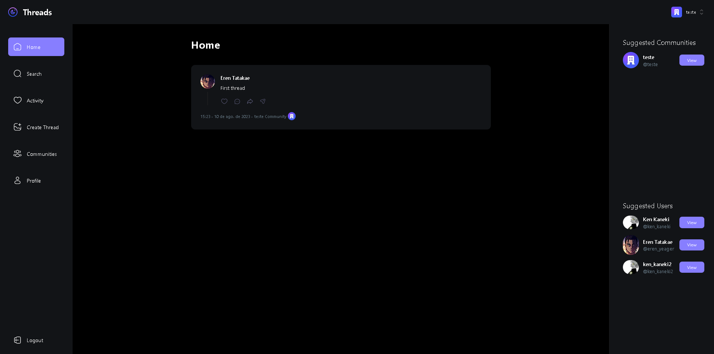

# Application - Threads

Check the [backend here](https://github.com/matheusjustino/threads-backend)!

## Resume

    This is an application where users can register and make posts to interact with other users.
    In addition, it's also possible to create, participate and publish in communities.

## Information

**In this project were used:** **`NextJs, Clerk, TailwindCSS and Shadcn-ui`**.
**as main tools and technologies.**

## Application Screenshots

 
 
 
 

